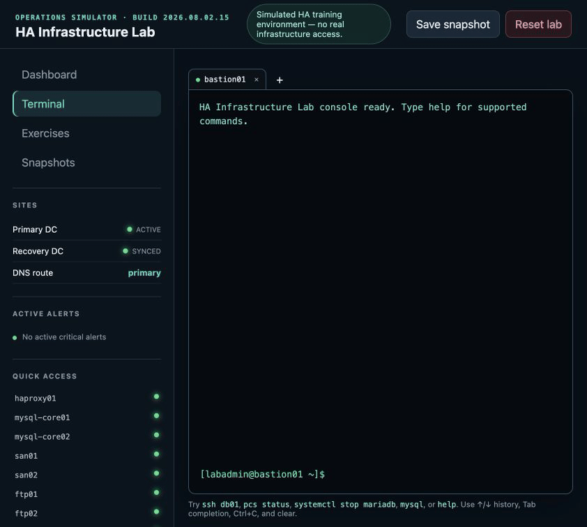
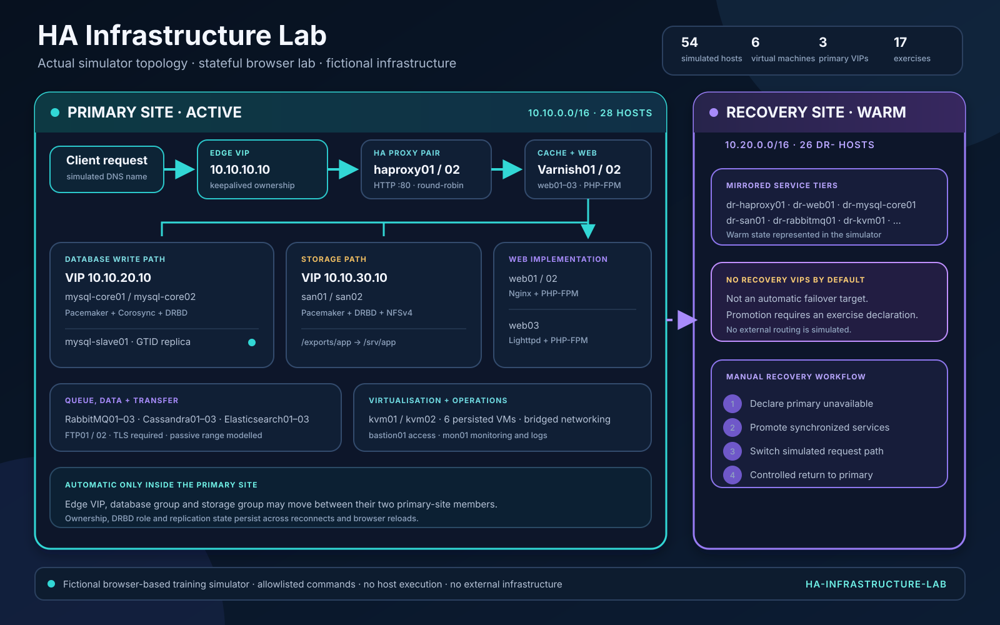

# HA Infrastructure Lab

A browser-based high-availability training simulator. It models a two–data-centre Linux estate — HAProxy/keepalived at the edge, Pacemaker + Corosync + DRBD under the database and storage tiers, GTID replication out to a read tier, KVM/libvirt underneath — and lets you break it and fix it from an allowlisted Linux-style terminal.

**[▶ Live demo](https://midhungovind-cpu.github.io/ha-infrastructure-lab/)** · **[Architecture reference](ARCHITECTURE.md)**

Everything runs locally in the browser. There are no external connections, nothing is executed on the host, and all hostnames, addresses, credentials and configuration files are fictional.



---

## Why this exists

Most HA knowledge is only provable in front of a rack. This is an attempt to make the *reasoning* provable instead: a deterministic model of a production-shaped estate, seventeen focused exercises drawn from real incident classes, and a success criterion for each one that a service restart alone cannot satisfy.

The recurring lesson is that **a running process alone does not prove a healthy service**. Replication and shard allocation can fail while their processes are running; other incidents, such as a stale PID, prevent the service from starting at all. Verify both process state and the client-facing result.

## Quick start

Requires Node.js 18 or newer.

```bash
git clone https://github.com/midhungovind-cpu/ha-infrastructure-lab.git
cd ha-infrastructure-lab
npm start          # serves on http://127.0.0.1:4173
```

There is no build step. Use the local HTTP server above; opening `index.html` as a `file://` URL can block JavaScript modules.

```bash
npm test           # engine unit tests
```

## A first run

```
ssh root@mysql-core01
systemctl stop mariadb          # kill the write path
pcs status                      # watch the group relocate
exit
ssh root@mysql-core02
ip a | grep 10.10.20.10         # confirm the new owner holds the VIP
drbdadm status                  # confirm the promoted data role
exit
ssh root@mysql-slave01
mysql -e "SHOW SLAVE STATUS\G"  # confirm the replica re-attached
```

State persists across reconnects and page reloads. The **Exercises** tab injects and resets scenarios; **Snapshots** preserves a point in time so you can retry a drill from the same starting state.

## What is modelled

| Tier | Nodes | Mechanism |
| --- | --- | --- |
| Edge | haproxy01/02 | HAProxy L7 + keepalived VRRP, VIP 10.10.10.10 |
| Cache | varnish01/02 | Varnish cache |
| Web | web01–03 | `web01/02`: Nginx + PHP-FPM; `web03`: Lighttpd + PHP-FPM |
| Database | mysql-core01/02, mysql-slave01 | Pacemaker + DRBD protocol C, VIP 10.10.20.10, GTID replication |
| Storage | san01/02 | DRBD + NFSv4 under Pacemaker, VIP 10.10.30.10 |
| Transfer | ftp01/02 | Pure-FTPd, TLS required, passive range |
| Queue &amp; data | rabbitmq01–03, cassandra01–03, elasticsearch01–03 | Three-node service clusters; membership, node health and allocation state |
| Virtualisation | kvm01/02 | libvirt-style VM management and bridged networking |
| Recovery site | `dr-` mirror of the above on 10.20.0.0/16 | Warm; promoted by declaration, never automatically |

The modelled topology, ownership rules, recovery flow and exercise coverage are in **[ARCHITECTURE.md](ARCHITECTURE.md)**.



## The drills

Seventeen focused exercises across twelve incident categories, each with a symptom, a triage sequence, a root cause and a success criterion. Solutions stay hidden until requested.

1. HAProxy will not start after a crash — stale PID file
2. Config change broke the proxy — invalid directive survives a reload
3. MariaDB crashed; cluster failed over — failed action needs cleanup
4. Replica stopped — duplicate key 1062
5. DRBD peers Disconnected — port 7789 dropped by firewalld
6. DRBD split brain — Primary/Primary
7. Database VIP moved with a failed action — clean up the cluster history
8. SAN filesystem at 98 % — core file, and the inode check people skip
9. Active SAN node offline — recover without a second interruption
10. Secure FTP failing — expired certificate *and* a missing passive range
11. Guests lost backend connectivity — bridge slave on the wrong master
12. RabbitMQ cookie mismatch
13. Cassandra node marked DOWN
14. Elasticsearch allocation disabled
15. Primary site unreachable — declare recovery readiness
16. Recovery-site promotion required
17. Primary site ready for controlled return

## Project layout

```
src/state.js       deterministic initial topology and the persisted state store
src/engine.js      allowlisted command parser, virtual filesystem, HA event engine
src/scenarios.js   scenario definitions, root causes, health predicates
src/app.js         terminal tabs, dashboard, scenario UI, rendering
lab-images/        illustrative fictional seed configuration files
tests/             engine unit tests (node --test)
```

The engine favours consistent operational behaviour over emulating every shell feature. Safe pipelines support `grep`, `egrep`, `head`, `tail`, `sort` and `wc`; unsupported commands return an explicit lab message rather than pretending to work.

Site exercises 15–17 use `labctl site status|declare|promote|return` from the bastion. These are simulator-only operator controls, not Linux commands; run each action separately. See the [site recovery flow](ARCHITECTURE.md#across-sites) for the sequence and modelling boundaries. Exercises require new, relevant-host command evidence after injection.

The supported incident diagnostics use node state, because the drills ask you to prove things with it:

- `ps` lists only the services actually running on that node, with the same PID `systemctl status` reports — so "no process owns this PID file" is a check you can really make.
- `systemctl status` records a start time and PID per service, so a restart is visible and a stopped unit has no `Main PID`.
- `df` models the root and replicated volumes separately; filling `/tmp` does not move the DRBD volume's usage.
- `mount -a` reads `/etc/fstab` and is idempotent; `showmount` reads `/etc/exports` and reports an unavailable NFS server.
- Starting a Pacemaker-managed resource by hand on the standby node is stopped by the cluster and recorded as a failed action, as it would be on a real estate.

Browser controls use in-page dialogs for hints, explanations, snapshots, reset and VM power confirmation. Clean-state restoration keeps named snapshots; **Reset lab** explicitly clears them. See [verification coverage](docs/VERIFICATION.md) for the tested paths and limitations.

## Disclaimer

All hostnames, IP addresses, credentials and configuration in this repository are fictional and exist only to model a topology. Addresses use RFC 1918 private ranges. Nothing here is taken from any employer or client environment.

## License

MIT — see [LICENSE](LICENSE).
